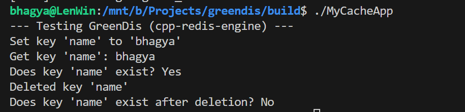

<div align="center">
  <h1>GreenDis</h1>
  <p><b>A Lightweight, Embeddable Redis-Like Engine in Modern C++</b></p>
</div>

Welcome to **GreenDis**, an educational and highly performant in-memory key-value store. This project aims to replicate the core functionalities of Redis natively in C++, allowing developers to embed it directly into their applications without needing external server setups.

---

##  How We Test It (`main.cpp`)

To get started quickly, we use `src/main.cpp` as our primary testing ground. Think of it as a lightweight client that instantiates the engine natively, bypassing any network or socket overhead. 

Running the engine locally in `main.cpp` allows us to verify data structures and memory manipulation quickly.

```cpp
#include "storage/MemoryStore.h"
#include <iostream>

using namespace std;

int main() {
    redis_engine::storage::MemoryStore store;

    store.Set("name", "bhagya");

    auto value = store.Get("name");
    if (value.has_value()) {
        cout << "Value retrieved: " << value.value() << endl;
    }

    return 0;
}
```

---

##  Understanding `cpp-redis-engine`

At the heart of the project sits the **`cpp-redis-engine`**. Let's break down how it works in a simpler way:

Instead of creating a giant, bloated database, `cpp-redis-engine` uses a concept called **Memory-Mapped Storage**. 
1. **The Hash Table (`std::unordered_map`)**: Under the hood, your keys and values are stored in a lightning-fast hash map. 
2. **Entries (`Entry.h`)**: Each value isn't just a raw string. It's wrapped in an `Entry` object that keeps track of metadata (like *Time-To-Live / TTL* and *Last Accessed Time*).
3. **Thread Safety (`std::shared_mutex`)**: Multiple threads can `Get` (read) values at the same time using a shared lock, but only one thread can `Set` (write) or `Delete` using an exclusive lock. This guarantees no data races while maintaining blazing-fast read operations.

It behaves exactly like Redis, but natively in your C++ memory block!

---

##  Modifying the Engine: Adding an `Exists` Command

To understand how easily extensible `cpp-redis-engine` is, let's walk through adding a custom command! Redis has an `EXISTS key` command, so let's implement it inside our engine.

### Step 1: Declare the function in `MemoryStore.h`
First, we go inside the engine's header file (`cpp-redis-engine/src/storage/MemoryStore.h`) and declare our new capability.

```cpp
    std::optional<std::string> Get(const std::string& key);
    bool Delete(const std::string& key);
    
    bool Exists(const std::string& key) const;   
```

### Step 2: Implement the logic in `MemoryStore.cpp`
Next, we define what the `Exists` function actually does using our thread-safe principles.

```cpp
bool MemoryStore::Exists(const std::string& key) const {
    std::shared_lock<std::shared_mutex> lock(mutex_);
    
    auto it = table_.find(key);
    
    if (it == table_.end() || it->second.IsExpired()) {
        return false;
    }
    return true; 
}
```

### Step 3: Test It in `main.cpp`
Now that our engine understands how to check for keys, we test it in our entry point!

```cpp
    store.Set("name", "bhagya");

    bool exists = store.Exists("name");

    store.Delete("name");

    exists = store.Exists("name");
    cout << "Does key 'name' exist after deletion? " << (exists ? "Yes" : "No") << endl; 
```

And just like that, you've successfully added and tested a core Redis feature inside your custom engine!

###  Building and Running

You can easily compile and test this engine yourself using CMake! 
*(Note: If you are on Windows, we recommend doing this inside **WSL (Windows Subsystem for Linux)** for the best experience).*

```bash
mkdir build && cd build

cmake ..

cmake --build .

./MyCacheApp
```

### 🖥️ Expected Output




